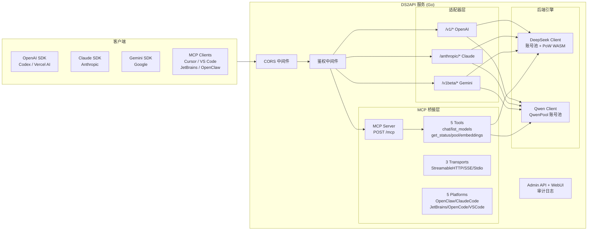

<p align="center">
  
</p>

# WEB2API

[](LICENSE)


[](https://github.com/fssl168/ds2api/releases)

[](https://www.npmjs.com/package/ds2api-mcp)

语言 / Language: [中文](README.MD) | [English](README.en.md)

> **本项目基于 [DS2API)](https://github.com/CJackHwang/ds2api) 原作二次开发，原作者 **CJackHwang**。**
>
> ds2API 原版核心能力（DeepSeek 多账号池、PoW WASM、OpenAI 兼容接口）保留并增强，新增通义千问引擎、MCP 桥接层、多平台插件客户端等扩展功能。

将 **DeepSeek** 与 **通义千问（Qwen）** 的 Web 对话能力转换为 **OpenAI / Claude / Gemini 兼容 API** + **MCP (Model Context Protocol) 独立桥接层**。

---

## 核心特性

- 高速流式输出 / 多轮对话 / R1 深度思考 / 多路账号轮询
- 与 ChatGPT 接口完全兼容（OpenAI / Claude / Gemini 三协议）
- MCP 独立桥接层（JSON-RPC 2.0，5 个工具，3 种传输模式）
- 通义千问 Qwen 账号池（Acquire/Release 并发控制）
- Admin WebUI 管理台 + 审计日志

> **免责声明**
>
> 逆向 API 不稳定，建议前往 [DeepSeek 官方](https://platform.deepseek.com/) 或 [通义千问官方](https://dashscope.aliyun.com/) 付费使用 API。
>
> 本项目仅供学习研究和个人自用，禁止对外提供服务或商用，风险自担。

---

## 架构概览



- **后端**：Go 1.24+（`cmd/ds2api/`、`internal/`），不依赖 Python 运行时
- **前端**：React 18 管理台（`webui/`），Vite + Tailwind CSS 构建
- **MCP 桥接层**：`internal/mcp/` — JSON-RPC 2.0 协议完整实现

---

## 功能一览

### API 兼容层

| 能力 | 说明 |
| --- | --- |
| **双引擎** | DeepSeek + 通义千问（Qwen），统一接口暴露 |
| OpenAI 兼容 | `GET /v1/models`、`POST /v1/chat/completions`、`POST /v1/embeddings` |
| Claude 兼容 | `POST /anthropic/v1/messages`、`count_tokens` |
| Gemini 兼容 | `POST /v1beta/models/{model}:generateContent` / `streamGenerateContent` |
| DeepSeek 账号池 | 自动 token 刷新、邮箱/手机双登录、PoW WASM 计算 |
| **Qwen 账号池** | Acquire/Release 模式、并发控制、健康检查、自动冷却 |

### MCP 桥接层 ✨

| 能力 | 说明 |
| --- | --- |
| **5 个工具** | `chat`、`list_models`、`get_status`、`get_pool_status`、`embeddings` |
| **10 个模型** | DeepSeek (4) + Qwen/通义千问 (6)，统一通过 MCP 协议暴露 |
| **3 种传输** | Streamable HTTP（默认）、SSE（事件流）、Stdio（子进程） |
| **5 平台支持** | OpenClaw、Claude Code、JetBrains、OpenCode、VS Code，含连接指南 API |
| **JSON-RPC 2.0** | initialize/tools/list/tools/call/ping 完整实现 |

### 其他能力

| 能力 | 说明 |
| --- | --- |
| Tool Calling | 防泄漏处理：多格式解析（XML/JSON/ANTML/invoke） |
| Admin API | 配置管理、运行时热更新、账号测试、批量导入导出 |
| **审计日志** | 环形缓冲区（200条）、9 种关键操作记录、WebUI 可视化查看 |
| WebUI 管理台 | `/admin` 单页应用（中英文双语、深色模式、Qwen 面板） |
| 运维探针 | `GET /healthz`（存活）、`GET /readyz`（就绪） |
| 安全加固 | 请求体大小限制、速率限制(120/min)、CORS 可配置、Session ID 随机化 |

---

## 平台兼容矩阵

| 级别 | 平台 | 接入方式 | 状态 |
| --- | --- | --- | --- |
| P0 | Codex CLI/SDK | `wire_api=chat/responses` | ✅ |
| P0 | OpenAI SDK | JS/Python | ✅ |
| P0 | Vercel AI SDK | openai-compatible | ✅ |
| P0 | Anthropic SDK | messages | ✅ |
| P0 | Google Gemini SDK | generateContent | ✅ |
| P0 | **MCP 协议** | Streamable HTTP / SSE / Stdio | ✅ |
| P1 | JetBrains IDEs | Kotlin 插件 | ✅ |
| P1 | LangChain / LlamaIndex | OpenAI 兼容接入 | ✅ |

---

## 模型支持

### DeepSeek 模型

| 模型 | thinking | search |
| --- | --- | --- |
| `deepseek-chat` | ❌ | ❌ |
| `deepseek-reasoner` | ✅ | ❌ |
| `deepseek-chat-search` | ❌ | ✅ |
| `deepseek-reasoner-search` | ✅ | ✅ |

### 通义千问模型（Qwen）

| 模型 | 说明 |
| --- | --- |
| `qwen-plus` | 千问 Plus |
| `qwen-max` | 千问 Max（高质量中文） |
| `qwen-coder` | 千问 Coder（代码专用） |
| `qwen-flash` | 千问 Flash（轻量快速） |
| `qwen3.5-plus` | Qwen 3.5 Plus（最新最强） |
| `qwen3.5-flash` | Qwen 3.5 Flash（最新快速） |

> Qwen 模型通过模型名前缀自动路由到通义千问引擎。

---

## 快速开始

### 1. 创建配置文件

```json
{
  "keys": ["your-api-key"],
  "accounts": [
    { "email": "user@example.com", "password": "your-password" },
    { "mobile": "13800138000", "password": "your-password" }
  ],
  "qwen_accounts": [
    { "ticket": "your-qwen-ticket", "label": "qwen-1" }
  ]
}
```

### 2. 启动服务

```bash
git clone https://github.com/fssl168/ds2api.git
cd ds2api
go run ./cmd/ds2api
```

默认监听：`http://localhost:5001`，管理后台：`http://localhost:5001/admin`

### 3. 测试 MCP 连接

```bash
curl -X POST http://localhost:5001/mcp \
  -H "Content-Type: application/json" \
  -d '{"jsonrpc":"2.0","id":1,"method":"initialize","params":{"protocolVersion":"2025-03-26","capabilities":{},"clientInfo":{"name":"test","version":"1.0"}}}'
```

---

## MCP 工具参考

| Tool | 参数 | 说明 |
| --- | --- | --- |
| **chat** | `model`, `messages[]`, `stream?`, `temperature?`, `max_tokens?` | 发送消息到 DeepSeek/Qwen |
| **list_models** | _(无)_ | 列出全部 10 个可用模型 |
| **get_status** | _(无)_ | 服务健康检查、账号池状态 |
| **get_pool_status** | `pool_type?: deepseek\|qwen\|all` | 账号池详情 |
| **embeddings** | `input: string[]`, `model?` | 文本向量嵌入 |

### MCP 端点

| 端点 | 方法 | 说明 |
| --- | --- | --- |
| `POST /mcp` | JSON-RPC 2.0 | Streamable HTTP 主入口 |
| `GET /mcp/sse` | SSE | Server-Sent Events 传输 |
| `GET /mcp/guides` | REST | 全部 5 平台连接指南 |
| `GET /mcp/guide/{platform}` | REST | 单平台详细指南 |

---

## Docker / Vercel 部署

### Docker

```bash
cp .env.example .env
docker-compose up -d
```

### Vercel Serverless

1. Fork 仓库 → Vercel 导入
2. 设置环境变量（`DS2API_ADMIN_KEY` + `DS2API_CONFIG_JSON`）
3. 部署

详细说明参阅 [部署指南](docs/DEPLOY.md)。

---

## 项目结构

```text
ds2api/
├── cmd/ds2api/              # 启动入口
├── api/
│   ├── index.go             # Vercel Serverless Go 入口
│   └── chat-stream.js       # Vercel Node.js 流式转发
├── internal/
│   ├── mcp/                 # ★ MCP 桥接层（7 文件）
│   │   ├── server.go       #   JSON-RPC Server 核心
│   │   ├── handler.go      #   5 个工具实现
│   │   ├── transport.go    #   StreamableHTTP / SSE / Stdio
│   │   ├── platform.go     #   5 平台 Config + RegisterTransport
│   │   ├── guides.go       #   各平台连接指南
│   │   ├── types.go        #   类型定义 + 错误码
│   │   └── registry.go     #   插件注册表
│   ├── account/             # DeepSeek 账号池
│   ├── adapter/             # OpenAI / Claude / Gemini 适配器
│   ├── admin/               # Admin API + 审计日志
│   ├── auth/                # 鉴权与 JWT
│   ├── config/              # 配置加载与编解码
│   ├── deepseek/            # DeepSeek 客户端 + PoW WASM
│   ├── qwen/                # ★ 通义千问客户端 + QwenPool
│   ├── server/              # HTTP 路由（chi router）
│   └── webui/               # WebUI 静态文件托管
├── webui/                   # React WebUI 源码（Vite + Tailwind）
├── packages/ds2api-mcp/     # npm SDK（Client/Server/CLI）
├── docs/
│   ├── DEPLOY.md            # 部署指南
│   └── API.md               # API 接口文档
├── Dockerfile
├── docker-compose.yml
├── go.mod / go.sum
└── README.MD
```

---

## 配置说明

### config.json 关键字段

| 字段 | 类型 | 说明 |
| --- | --- | --- |
| `keys` | `string[]` | API 访问密钥列表 |
| `accounts` | `Account[]` | DeepSeek 账号（email 或 mobile 登录） |
| **`qwen_accounts`** | **`QwenAccount[]`** | **★ 通义千问账号（ticket + label）** |
| `model_aliases` | `map[string]string` | 模型名映射 |
| `runtime.account_max_inflight` | `int` | 每账号最大并发（默认 2） |
| `runtime.global_max_inflight` | `int` | 全局最大并发（0 = 自动） |

### 环境变量

| 变量 | 用途 | 默认值 |
| --- | --- | --- |
| `PORT` | 服务端口 | `5001` |
| `DS2API_ADMIN_KEY` | Admin 登录密钥 | `admin` |
| `DS2API_CONFIG_JSON` | 配置注入（JSON 或 Base64） | — |
| `CORS_ORIGIN` | CORS 允许的 Origin（空=*, 安全建议设具体值） | `*` |
| `LOG_LEVEL` | 日志级别 | `INFO` |

---

## 文档索引

| 文档 | 说明 |
| --- | --- |
| [API.md](API.md) | API 接口文档（含请求/响应示例） |
| [DEPLOY.md](docs/DEPLOY.md) | 部署指南（本地/Docker/Vercel/systemd） |
| [CONTRIBUTING.md](docs/CONTRIBUTING.md) | 贡献指南 |
| [TESTING.md](docs/TESTING.md) | 测试集使用指南 |

---

## 测试

```bash
go build ./... && go test ./...
```

MCP 桥接层已通过 **17/17** 全项测试（initialize / tools-list / ping / 5 tools-call / guides / errors / CORS）。

---

## 致谢

- **[CJackHwang/ds2api](https://github.com/CJackHwang/ds2api)** — 本项目基于 ds2API 原作二次开发
- **[LLM-Red-Team/qwen-free-api](https://github.com/LLM-Red-Team/qwen-free-api)** — 原始逆向研究基础

## License

[MIT](LICENSE) © [fssl168](https://github.com/fssl168)
