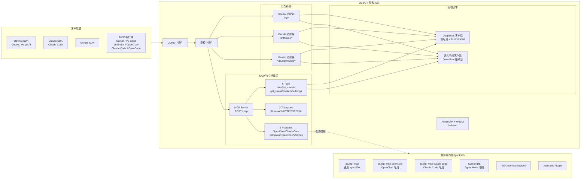

<p align="center">
  
</p>

# DS2API

[](LICENSE)


[](https://github.com/fssl168/ds2api/releases)

[](https://www.npmjs.com/package/ds2api-mcp)
[](https://www.npmjs.com/package/ds2api-mcp-openclaw)
[](https://www.npmjs.com/package/ds2api-mcp-claude-code)

语言 / Language: [中文](README.MD) | [English](README.en.md)

将 **DeepSeek** 与 **通义千问（Qwen）** 的 Web 对话能力转换为 **OpenAI / Claude / Gemini 兼容 API** + **MCP (Model Context Protocol) 独立桥接层**，并发布 **6 大平台插件客户端**。

> **重要免责声明**
>
> 本仓库仅供学习、研究、个人实验和内部验证使用，不提供任何形式的商业授权、适用性保证或结果保证。
>
> 作者及仓库维护者不对因使用、修改、分发、部署或依赖本项目而产生的任何直接或间接损失、账号封禁、数据丢失、法律风险或第三方索赔负责。

---

## 架构概览



- **后端**：Go 1.24+（`cmd/ds2api/`、`internal/`），不依赖 Python 运行时
- **前端**：React 18 管理台（`webui/`），Vite + Tailwind CSS 构建
- **MCP 桥接层**：`internal/mcp/` — 7 个 Go 文件，JSON-RPC 2.0 协议实现
- **插件发布**：`publish/` — 6 个平台包（3 npm + 2 VSIX + 1 Kotlin）

---

## 核心能力

### API 兼容层

| 能力 | 说明 |
| --- | --- |
| **双引擎支持** | DeepSeek + 通义千问（Qwen）双后端，统一接口暴露 |
| OpenAI 兼容 | `GET /v1/models`、`POST /v1/chat/completions`、`POST /v1/responses`、`POST /v1/embeddings` |
| Claude 兼容 | `POST /anthropic/v1/messages`、`POST /anthropic/v1/messages/count_tokens` |
| Gemini 兼容 | `POST /v1beta/models/{model}:generateContent` / `streamGenerateContent` |
| DeepSeek 多账号轮询 | 自动 token 刷新、邮箱/手机号双登录方式、PoW WASM 计算 |
| **Qwen 账号池** | Acquire/Release 模式、并发控制、等待队列、健康检查、自动冷却 |

### MCP 独立桥接层 ✨

| 能力 | 说明 |
| --- | --- |
| **5 个 MCP 工具** | `chat`、`list_models`、`get_status`、`get_pool_status`、`embeddings` |
| **10 个 AI 模型** | DeepSeek (4) + Qwen/通义千问 (6)，统一通过 MCP 协议暴露 |
| **3 种传输模式** | Streamable HTTP（默认）、SSE（事件流）、Stdio（子进程） |
| **5 平台内置支持** | OpenClaw、Claude Code、JetBrains、OpenCode、VS Code，含连接指南 API |
| **JSON-RPC 2.0 规范** | 完整实现 initialize/tools/list/tools/call/ping，错误码 -32700/-32601/-32602 |
| **零配置启动** | 自动发现 ds2api 服务，默认 `http://127.0.0.1:5001/mcp` |

### 插件客户端发布 📦

| 平台 | 包类型 | 包名 | 安装方式 |
| --- | --- | --- | --- |
| **npm 通用 SDK** | Node.js 包 | `ds2api-mcp` | `npm install -g ds2api-mcp` |
| **OpenClaw** | Node.js 包 | `ds2api-mcp-openclaw` | `npm install -g ds2api-mcp-openclaw` |
| **Claude Code** | Node.js 包 | `ds2api-mcp-claude-code` | `npm install -g ds2api-mcp-claude-code` |
| **Cursor IDE** | VSIX 扩展 | `ds2api-mcp-cursor` | VSIX 安装（Agent Mode 集成） |
| **VS Code** | VSIX 扩展 | `ds2api-mcp-vscode` | Marketplace 或 VSIX |
| **JetBrains** | Kotlin 插件 | `ds2api-mcp` | Plugins Marketplace |

### 其他能力

| 能力 | 说明 |
| --- | --- |
| Tool Calling | 防泄漏处理：非代码块高置信特征识别、多格式解析（XML/JSON/ANTML/invoke） |
| Admin API | 配置管理、运行时设置热更新、账号测试、批量导入导出 |
| WebUI 管理台 | `/admin` 单页应用（中英文双语、深色模式、Qwen 账号独立管理面板） |
| 运维探针 | `GET /healthz`（存活）、`GET /readyz`（就绪） |

---

## 平台兼容矩阵

| 级别 | 平台 | 接入方式 | 状态 |
| --- | --- | --- | --- |
| P0 | Codex CLI/SDK | `wire_api=chat` / `wire_api=responses` | ✅ |
| P0 | OpenAI SDK | JS/Python，chat + responses | ✅ |
| P0 | Vercel AI SDK | openai-compatible | ✅ |
| P0 | Anthropic SDK | messages | ✅ |
| P0 | Google Gemini SDK | generateContent | ✅ |
| P0 | **MCP 协议** | **Streamable HTTP / SSE / Stdio** | **✅ 已实现** |
| P0 | **Cursor IDE** | **VSIX 扩展 + Agent Mode** | **✅ 已发布** |
| P0 | **VS Code** | **VSIX 扩展 + 侧边栏模型树** | **✅ 已发布** |
| P0 | **Claude Code** | **npm stdio 包 + --config 一键配置** | **✅ 已发布** |
| P0 | **OpenClaw** | **npm 包 + streamable_http** | **✅ 已发布** |
| P1 | JetBrains IDEs | Kotlin 插件 + Settings UI | ✅ |
| P1 | LangChain / LlamaIndex / OpenWebUI | OpenAI 兼容接入 | ✅ |
| P2 | OpenCode | stdio 配置 | 文档就绪 |

---

## 模型支持

### DeepSeek 模型

| 模型 | thinking | search | 后端 |
| --- | --- | --- | --- |
| `deepseek-chat` | ❌ | ❌ | DeepSeek |
| `deepseek-reasoner` | ✅ | ❌ | DeepSeek |
| `deepseek-chat-search` | ❌ | ✅ | DeepSeek |
| `deepseek-reasoner-search` | ✅ | ✅ | DeepSeek |

### 通义千问模型（Qwen）

| 模型 | 说明 | 后端 |
| --- | --- | --- |
| `qwen-plus` | 千问 Plus | 通义千问 |
| `qwen-max` | 千问 Max（高质量中文） | 通义千问 |
| `qwen-coder` | 千问 Coder（代码专用） | 通义千问 |
| `qwen-flash` | 千问 Flash（轻量快速） | 通义千问 |
| `qwen3.5-plus` | Qwen 3.5 Plus（最新最强） | 通义千问 |
| `qwen3.5-flash` | Qwen 3.5 Flash（最新快速） | 通义千问 |

> Qwen 模型通过模型名前缀自动路由到通义千问引擎。调用时使用与 DeepSeek 相同的 OpenAI 兼容接口格式。

---

## 快速开始

### 第一步：创建配置文件

```json
{
  "keys": ["your-api-key-1", "your-api-key-2"],
  "accounts": [
    { "email": "user@example.com", "password": "your-password" },
    { "mobile": "13800138000", "password": "your-password" }
  ],
  "qwen_accounts": [
    { "ticket": "your-qwen-ticket-string", "label": "qwen-account-1" }
  ]
}
```

### 第二步：启动服务

```bash
# 克隆仓库
git clone https://github.com/fssl168/ds2api.git
cd ds2api

# 启动
go run ./cmd/ds2api
```

默认监听：`http://localhost:5001`，管理后台：`http://localhost:5001/admin`

### 第三步：接入 MCP（可选）

服务启动后，MCP 端点自动可用：

```bash
# 测试 MCP 连接
curl -X POST http://localhost:5001/mcp \
  -H "Content-Type: application/json" \
  -d '{"jsonrpc":"2.0","id":1,"method":"initialize","params":{"protocolVersion":"2025-03-26","capabilities":{},"clientInfo":{"name":"test","version":"1.0"}}}'
```

各平台安装插件客户端即可一键接入（见下方「MCP 插件安装」章节）。

---

## MCP 插件安装

### Claude Code（推荐）

```bash
# 安装 Claude Code 专用包
npm install -g ds2api-mcp-claude-code

# 一键生成配置
ds2api-claude --config >> ~/.claude/settings.json
```

或手动编辑 `~/.claude/settings.json`：

```json
{
  "mcpServers": {
    "ds2api": {
      "command": "npx",
      "args": ["ds2api-mcp-claude-code"],
      "env": { "DS2API_BASE_URL": "http://127.0.0.1:5001" }
    }
  }
}
```

### Cursor IDE

```bash
# 构建 VSIX（需先 cd publish/cursor && npm install && npm run compile）
npx vsce package
# 在 Cursor 中：Extensions → Install from VSIX → 选择 .vsix 文件
```

Cursor 特有功能：
- **Agent Mode 集成**：自动注入 `.cursor/rules/ds2api.mdc`
- **右键 Chat**：选中代码 → `Chat with DeepSeek` / `Chat with Qwen`
- **侧边栏 Chat Panel**：内置聊天 UI，8 模型切换器

### VS Code

创建 `.vscode/mcp.json`：

```json
{
  "servers": {
    "ds2api": {
      "type": "streamable-http",
      "url": "http://127.0.0.1:5001/mcp"
    }
  }
}
```

VS Code 特有功能：
- 状态栏实时连接状态
- 侧边栏模型浏览器（10 模型 TreeView）
- 命令面板集成（`Ctrl+Shift+P` → ds2api:）

### OpenClaw

```bash
npm install -g ds2api-mcp-openclaw
```

配置 `openclaw.json`：

```json
{
  "mcpServers": {
    "ds2api": { "type": "streamable_http", "url": "http://127.0.0.1:5001/mcp" }
  }
}
```

### JetBrains IDEs

Settings → Tools → Model Context Protocol → Servers → Add：
- Name: `ds2api`
- Type: Streamable HTTP
- URL: `http://127.0.0.1:5001/mcp`

### OpenCode

配置 `~/.config/opencode/config.json`：

```json
{
  "mcp": {
    "servers": [{ "name": "ds2api", "command": "npx", "args": ["ds2api-mcp"] }]
  }
}
```

### 通用 npm SDK（编程使用）

```bash
npm install -g ds2api-mcp
```

```typescript
import { Ds2ApiClient } from "ds2api-mcp";

const client = new Ds2ApiClient({ baseURL: "http://127.0.0.1:5001" });

// Chat with Qwen
const reply = await client.chat({
  model: "qwen-plus",
  messages: [{ role: "user", content: "Hello!" }],
});
console.log(reply); // "HiHi"

// List all models
const models = await client.listModels();

// Health check
const ok = await client.healthCheck();
```

---

## MCP 工具参考

| Tool | 参数 | 说明 |
| --- | --- | --- |
| **chat** | `model`, `messages[]`, `stream?`, `temperature?`, `max_tokens?` | 发送消息到 DeepSeek/Qwen 模型 |
| **list_models** | _(无)_ | 列出全部 10 个可用模型及引擎信息 |
| **get_status** | _(无)_ | 服务健康检查、账号池状态、版本信息 |
| **get_pool_status** | `pool_type?: deepseek\|qwen\|all` | DeepSeek PoW/WASM 池 + Qwen Acquire/Release 池详情 |
| **embeddings** | `input: string[]`, `model?` | 生成文本向量嵌入 |

### MCP 端点

| 端点 | 方法 | 说明 |
| --- | --- | --- |
| `POST /mcp` | JSON-RPC 2.0 | Streamable HTTP 主入口 |
| `GET /mcp/sse` | SSE | Server-Sent Events 传输 |
| `GET /mcp/guides` | REST | 全部 5 平台连接指南 |
| `GET /mcp/guide/{platform}` | REST | 单平台详细指南（openclaw/claude-code/jetbrains/opencode/vscode） |

---

## Docker / Vercel 部署

### Docker

```bash
cp .env.example .env
# 编辑 .env（至少设置 DS2API_ADMIN_KEY）
docker-compose up -d
```

### Vercel Serverless

1. Fork 仓库 → Vercel 导入
2. 设置环境变量（`DS2API_ADMIN_KEY` + `DS2API_CONFIG_JSON`）
3. 部署

> 流式说明：`/v1/chat/completions` 在 Vercel 上走 `api/chat-stream.js`（Node Runtime）保证实时 SSE。

详细部署说明请参阅 [部署指南](docs/DEPLOY.md) 和 [发布指南](docs/PUBLISH.md)。

---

## 项目结构

```text
ds2api/
├── cmd/
│   └── ds2api/              # 启动入口
├── api/
│   ├── index.go             # Vercel Serverless Go 入口
│   └── chat-stream.js       # Vercel Node.js 流式转发
│
├── internal/
│   ├── mcp/                 # ★ MCP 独立桥接层（7 文件）
│   │   ├── server.go       #   JSON-RPC Server 核心
│   │   ├── types.go        #   类型定义 + 错误码
│   │   ├── handler.go      #   5 个工具实现
│   │   ├── transport.go    #   StreamableHTTP / SSE / Stdio
│   │   ├── platform.go     #   5 平台 Config + RegisterTransport
│   │   ├── guides.go       #   各平台 Guide 内容
│   │   └── registry.go     #   插件注册表 + Guide API
│   │
│   ├── account/             # DeepSeek 账号池
│   ├── adapter/             # OpenAI / Claude / Gemini 适配器
│   ├── admin/               # Admin API handlers
│   ├── auth/                # 鉴权与 JWT
│   ├── config/              # 配置加载与编解码
│   ├── deepseek/            # DeepSeek 客户端 + PoW WASM
│   ├── qwen/                # ★ 通义千问客户端 + QwenPool
│   ├── server/              # HTTP 路由（chi router）
│   ├── sse/                 # SSE 解析工具
│   ├── stream/              # 统一流式消费引擎
│   └── webui/               # WebUI 静态文件托管
│
├── publish/                 # ★ 插件发布包（6 个平台）
│   ├── ds2api-mcp/          #   npm 通用 SDK
│   ├── openclaw/           #   npm OpenClaw 专用
│   ├── claude-code/        #   npm Claude Code 专用
│   ├── cursor/             #   VSIX Cursor IDE
│   ├── vscode/             #   VSIX VS Code
│   └── jetbrains/          #   Kotlin JetBrains 插件
│
├── webui/                   # React WebUI 源码（Vite + Tailwind）
├── static/admin/            # WebUI 构建产物
├── Dockerfile
├── docker-compose.yml
├── docs/
│   ├── DEPLOY.md           # 部署指南
│   └── PUBLISH.md          # ★ 插件发布指南（8 平台）
├── go.mod / go.sum
└── README.MD
```

---

## 配置说明

### config.json 关键字段

| 字段 | 类型 | 说明 |
| --- | --- | --- |
| `keys` | `string[]` | API 访问密钥列表 |
| `accounts` | `Account[]` | DeepSeek 账号（email 或 mobile 登录） |
| **`qwen_accounts`** | **`QwenAccount[]`** | **★ 通义千问账号（ticket + label）** |
| `model_aliases` | `map[string]string` | 模型名映射（如 gpt-4o → deepseek-chat） |
| `claude_model_mapping` | `map[string]string` | Claude 模型映射 |
| `runtime.account_max_inflight` | `int` | 每账号最大并发（默认 2） |
| `runtime.global_max_inflight` | `int` | 全局最大并发（0 = 自动） |

完整字段说明见原 README 或 [API.md](API.md)。

### 环境变量

| 变量 | 用途 | 默认值 |
| --- | --- | --- |
| `PORT` | 服务端口 | `5001` |
| `DS2API_ADMIN_KEY` | Admin 登录密钥 | `admin` |
| `DS2API_CONFIG_JSON` | 配置注入（JSON 或 Base64） | — |
| `DS2API_ACCOUNT_MAX_INFLIGHT` | 每账号最大并发 | `2` |
| `LOG_LEVEL` | 日志级别 | `INFO` |

---

## 发布到各平台

详见 [docs/PUBLISH.md](docs/PUBLISH.md) 完整发布指南：

| 平台 | 命令 | 产物 |
| --- | --- | --- |
| **npm SDK** | `cd packages/ds2api-mcp && npm publish` | `ds2api-mcp@1.0.0` |
| **npm OpenClaw** | `cd publish/openclaw && npm publish` | `ds2api-mcp-openclaw@1.0.0` |
| **npm Claude Code** | `cd publish/claude-code && npm publish` | `ds2api-mcp-claude-code@1.0.0` |
| **VS Code** | `cd publish/vscode && npx vsce publish` | `.vsix` → Marketplace |
| **Cursor** | `cd publish/cursor && npx vsce package` | `.vsix` → 手动安装 |
| **JetBrains** | 手动上传 zip | plugins.jetbrains.com |

---

## 文档索引

| 文档 | 说明 |
| --- | --- |
| [API.md](API.md) | API 接口文档（含请求/响应示例） |
| [DEPLOY.md](docs/DEPLOY.md) | 部署指南（本地/Docker/Vercel/systemd） |
| [PUBLISH.md](docs/PUBLISH.md) | **★ 插件发布指南（8 平台详细步骤）** |
| [CONTRIBUTING.md](docs/CONTRIBUTING.md) | 贡献指南 |
| [TESTING.md](docs/TESTING.md) | 测试集使用指南 |

---

## 测试

```bash
# Go 编译 + 单元测试
go build ./... && go test ./...

# MCP 端到端测试（服务运行在 localhost:5001）
# Initialize → tools/list → ping → tools/call × 5 tools → Guides API → Error handling
```

MCP 桥接层已通过 **17/17** 全项测试（initialize / tools-list / ping / 5 tools-call / guides / errors / CORS）。

---

## License

[MIT](LICENSE) © [fssl168](https://github.com/fssl168)
