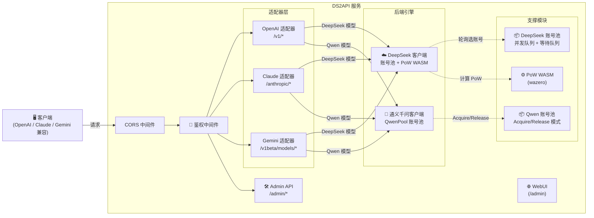

<p align="center">
  
</p>

# DS2API

[](LICENSE)


[](https://github.com/fssl168/ds2api/releases)
[](docs/DEPLOY.md)
[](https://zeabur.com/templates/L4CFHP)
[](https://vercel.com/new/clone?repository-url=https://github.com/fssl168/ds2api)

语言 / Language: [中文](README.MD) | [English](README.en.md)

将 **DeepSeek** 与 **通义千问（Qwen）** 的 Web 对话能力转换为 OpenAI、Claude 与 Gemini 兼容 API。后端为 **Go 全量实现**，前端为 React WebUI 管理台（源码在 `webui/`，部署时自动构建到 `static/admin`）。

> **重要免责声明**
>
> 本仓库仅供学习、研究、个人实验和内部验证使用，不提供任何形式的商业授权、适用性保证或结果保证。
>
> 作者及仓库维护者不对因使用、修改、分发、部署或依赖本项目而产生的任何直接或间接损失、账号封禁、数据丢失、法律风险或第三方索赔负责。
>
> 请勿将本项目用于违反服务条款、协议、法律法规或平台规则的场景。商业使用前请自行确认 `LICENSE`、相关协议以及你是否获得了作者的书面许可。

## 架构概览



- **后端**：Go 1.24+（`cmd/ds2api/`、`api/`、`internal/`），不依赖 Python 运行时
- **前端**：React 18 管理台（`webui/`），Vite + Tailwind CSS 构建
- **部署**：本地运行、Docker、Vercel Serverless、Linux systemd、Zeabur

## 核心能力

| 能力 | 说明 |
| --- | --- |
| **双引擎支持** | DeepSeek + 通义千问（Qwen）双后端，统一 OpenAI 接口暴露 |
| OpenAI 兼容 | `GET /v1/models`、`POST /v1/chat/completions`、`POST /v1/responses`、`POST /v1/embeddings` |
| Claude 兼容 | `POST /anthropic/v1/messages`、`POST /anthropic/v1/messages/count_tokens` |
| Gemini 兼容 | `POST /v1beta/models/{model}:generateContent` / `streamGenerateContent` |
| DeepSeek 多账号轮询 | 自动 token 刷新、邮箱/手机号双登录方式、PoW WASM 计算 |
| **Qwen 账号池** | Acquire/Release 模式、并发控制、等待队列、健康检查、自动冷却 |
| 并发队列控制 | 每账号 in-flight 上限 + 等待队列，动态计算建议并发值 |
| Tool Calling | 防泄漏处理：非代码块高置信特征识别、多格式解析（XML/JSON/ANTML/invoke） |
| Admin API | 配置管理、运行时设置热更新、账号测试、批量导入导出、Vercel 同步 |
| **Qwen 账号管理** | CRUD API、池状态监控、批量导入（全量模板含 qwen_only 专用模板） |
| WebUI 管理台 | `/admin` 单页应用（中英文双语、深色模式、Qwen 账号独立管理面板） |
| 运维探针 | `GET /healthz`（存活）、`GET /readyz`（就绪） |

## 平台兼容矩阵

| 级别 | 平台 | 当前状态 |
| --- | --- | --- |
| P0 | Codex CLI/SDK（`wire_api=chat` / `wire_api=responses`） | ✅ |
| P0 | OpenAI SDK（JS/Python，chat + responses） | ✅ |
| P0 | Vercel AI SDK（openai-compatible） | ✅ |
| P0 | Anthropic SDK（messages） | ✅ |
| P0 | Google Gemini SDK（generateContent） | ✅ |
| P1 | LangChain / LlamaIndex / OpenWebUI（OpenAI 兼容接入） | ✅ |
| P2 | MCP 独立桥接层 | 规划中 |

## 模型支持

### DeepSeek 模型（OpenAI 接口）

| 模型 | thinking | search | 后端 |
| --- | --- | --- | --- |
| `deepseek-chat` | ❌ | ❌ | DeepSeek |
| `deepseek-reasoner` | ✅ | ❌ | DeepSeek |
| `deepseek-chat-search` | ❌ | ✅ | DeepSeek |
| `deepseek-reasoner-search` | ✅ | ✅ | DeepSeek |

### 通义千问模型（OpenAI 接口）

| 模型 | 说明 | 后端 |
| --- | --- | --- |
| `qwen-plus` | 千问 Plus | 通义千问 |
| `qwen-max` | 千问 Max | 通义千问 |
| `qwen-coder` | 千问 Coder | 通义千问 |
| `qwen-flash` | 千问 Flash（轻量快速） | 通义千问 |
| `qwen3.5-plus` | Qwen 3.5 Plus | 通义千问 |
| `qwen3.5-flash` | Qwen 3.5 Flash | 通义千问 |

> Qwen 模型通过模型名前缀自动路由到通义千问引擎。调用时使用与 DeepSeek 相同的 OpenAI 兼容接口格式。

### Claude 接口（映射到 DeepSeek）

| 模型 | 默认映射 |
| --- | --- |
| `claude-sonnet-4-5` | `deepseek-chat` |
| `claude-haiku-4-5`（兼容 `claude-3-5-haiku-latest`） | `deepseek-chat` |
| `claude-opus-4-6` | `deepseek-reasoner` |

可通过配置中的 `claude_mapping` 或 `claude_model_mapping` 覆盖映射关系。
另外，`/anthropic/v1/models` 现已包含 Claude 1.x/2.x/3.x/4.x 历史模型 ID 与常见别名，便于旧客户端直接兼容。

#### Claude Code 接入避坑（实测）

- `ANTHROPIC_BASE_URL` 推荐直接指向 DS2API 根地址（例如 `http://127.0.0.1:5001`），Claude Code 会请求 `/v1/messages?beta=true`。
- `ANTHROPIC_API_KEY` 需要与 `config.json` 中 `keys` 一致；建议同时保留常规 key 与 `sk-ant-*` 形态 key，兼容不同客户端校验习惯。
- 若系统设置了代理，建议对 DS2API 地址配置 `NO_PROXY=127.0.0.1,localhost,<你的主机IP>`，避免本地回环请求被代理拦截。
- 如遇"工具调用输出成文本、未执行"问题，请升级到包含 Claude 工具调用多格式解析（JSON/XML/ANTML/invoke）的版本。

### Gemini 接口

Gemini 适配器将模型名通过 `model_aliases` 或内置规则映射到 DeepSeek 原生模型，支持 `generateContent` 和 `streamGenerateContent` 两种调用方式，并完整支持 Tool Calling（`functionDeclarations` → `functionCall` 输出）。

## 快速开始

### 通用第一步（所有部署方式）

创建配置文件：

```json
{
  "keys": ["your-api-key-1", "your-api-key-2"],
  "accounts": [
    {
      "email": "user@example.com",
      "password": "your-password"
    },
    {
      "mobile": "13800138000",
      "password": "your-password"
    }
  ],
  "qwen_accounts": [
    {
      "ticket": "your-qwen-ticket-string",
      "label": "qwen-account-1"
    }
  ]
}
```

后续部署建议：
- 本地运行：直接读取 `config.json`
- Docker / Vercel：由 `config.json` 生成 `DS2API_CONFIG_JSON`（Base64）注入环境变量
- 兼容写法：`DS2API_CONFIG_JSON` 也可以直接写原始 JSON；`CONFIG_JSON` 是旧版回退变量

### 方式一：本地运行

**前置要求**：Go 1.24+，Node.js 20+（仅在需要构建 WebUI 时）

```bash
# 1. 克隆仓库
git clone https://github.com/fssl168/ds2api.git
cd ds2api

# 2. 创建配置文件 config.json（参考上方示例）

# 3. 启动
go run ./cmd/ds2api
```

默认监听地址：`http://localhost:5001`，管理后台：`http://localhost:5001/admin`

> **WebUI 自动构建**：本地首次启动时，若 `static/admin` 不存在，会自动尝试执行 `npm ci` 和 `npm run build`。你也可以手动构建：
> ```bash
> cd webui && npm run build -- --outDir ../static/admin --emptyOutDir
> ```

### 方式二：Docker 运行

```bash
# 1. 准备环境变量和配置文件
cp .env.example .env
# 编辑 .env（至少设置 DS2API_ADMIN_KEY）

# 2. 创建 config.json（参考上方示例）

# 3. 启动
docker-compose up -d

# 4. 查看日志
docker-compose logs -f
```

默认 `docker-compose.yml` 会把宿主机 `6011` 映射到容器内的 `5001`。更新镜像：`docker-compose up -d --build`

#### Zeabur 一键部署（Dockerfile）

1. 点击上方 "Deploy on Zeabur" 按钮，一键部署。
2. 部署完成后访问 `/admin`，使用环境变量中的 `DS2API_ADMIN_KEY` 登录。
3. 在管理台导入/编辑配置（会写入并持久化到 `/data/config.json`）。

### 方式三：Vercel 部署

1. Fork 仓库到自己的 GitHub
2. 在 Vercel 上导入项目
3. 配置环境变量（最少设置 `DS2API_ADMIN_KEY`；推荐同时设置 `DS2API_CONFIG_JSON`）
4. 部署

推荐先本地把 `config.json` 转 Base64 再粘贴：

```bash
base64 < config.json | tr -d '\n'
```

> **流式说明**：`/v1/chat/completions` 在 Vercel 上默认走 `api/chat-stream.js`（Node Runtime）以保证实时 SSE。鉴权、账号选择、会话/PoW 准备仍由 Go 内部 prepare 接口完成。

详细部署说明请参阅 [部署指南](docs/DEPLOY.md)。

### 方式四：下载 Release 构建包

每次发布 Release 时，GitHub Actions 会自动构建多平台二进制包：

```bash
tar -xzf ds2api_<tag>_linux_amd64.tar.gz
cd ds2api_<tag>_linux_amd64
cp config.example.json config.json
./ds2api
```

## 配置说明

### `config.json` 完整示例

```json
{
  "keys": ["your-api-key-1", "your-api-key-2"],
  "accounts": [
    {
      "email": "user@example.com",
      "password": "your-password"
    },
    {
      "mobile": "13800138000",
      "password": "your-password"
    }
  ],
  "qwen_accounts": [
    {
      "ticket": "your-qwen-ticket-string",
      "label": "qwen-account-1"
    },
    {
      "ticket": "another-ticket-string",
      "label": "qwen-account-2"
    }
  ],
  "model_aliases": {
    "gpt-4o": "deepseek-chat",
    "gpt-5-codex": "deepseek-reasoner",
    "o3": "deepseek-reasoner"
  },
  "compat": {
    "wide_input_strict_output": true
  },
  "responses": {
    "store_ttl_seconds": 900
  },
  "embeddings": {
    "provider": "deterministic"
  },
  "claude_model_mapping": {
    "fast": "deepseek-chat",
    "slow": "deepseek-reasoner"
  },
  "admin": {
    "jwt_expire_hours": 24
  },
  "runtime": {
    "account_max_inflight": 2,
    "account_max_queue": 0,
    "global_max_inflight": 0,
    "token_refresh_interval_hours": 6
  },
  "auto_delete": {
    "sessions": false
  }
}
```

#### 字段说明

| 字段 | 类型 | 说明 |
| --- | --- | --- |
| `keys` | `string[]` | API 访问密钥列表，客户端通过 `Authorization: Bearer <key>` 鉴权 |
| `accounts` | `Account[]` | DeepSeek 账号列表，支持 `email` 或 `mobile` 登录 |
| `accounts[].token` | `string` | 运行时自动获取的 session token，**配置中填写也会被清空**，仅内存维护 |
| **`qwen_accounts`** | **`QwenAccount[]`** | **通义千问账号列表，每个账号包含 ticket（凭证）和 label（显示名）** |
| **`qwen_accounts[].ticket`** | **`string`** | **通义千问凭证（类似 API Key），完整保留在导出中** |
| **`qwen_accounts[].label`** | **`string`** | **显示标签，用于区分不同千问账号** |
| `model_aliases` | `map[string]string` | 常见模型名到实际模型的映射（如 gpt-4o → deepseek-chat） |
| `compat.wide_input_strict_output` | `bool` | 建议保持 `true`（宽进严出模式） |
| `responses.store_ttl_seconds` | `int` | `/v1/responses/{id}` 内存缓存 TTL（秒） |
| `embeddings.provider` | `string` | Embedding 提供方（`deterministic`/`mock`/`builtin`） |
| `claude_model_mapping` | `map[string]string` | Claude 模型映射（fast/slow → deepseek 模型） |
| `admin.jwt_expire_hours` | `int` | Admin JWT 过期时间（小时） |
| `runtime.account_max_inflight` | `int` | 每账号最大并发数（默认 2，0 = 自动计算） |
| `runtime.account_max_queue` | `int` | 等待队列上限（默认 = 建议并发值） |
| `runtime.global_max_inflight` | `int` | 全局最大并发数（0 = 自动计算） |
| `runtime.token_refresh_interval_hours` | `int` | DeepSeek token 强制重登间隔（默认 6 小时） |
| `auto_delete.sessions` | `bool` | 请求结束后是否自动清理 DeepSeek 会话（默认 false） |

### 环境变量

| 变量 | 用途 | 默认值 |
| --- | --- | --- |
| `PORT` | 服务端口 | `5001` |
| `LOG_LEVEL` | 日志级别 | `INFO`（可选：`DEBUG`/`WARN`/`ERROR`） |
| `DS2API_ADMIN_KEY` | Admin 登录密钥 | `admin` |
| `DS2API_JWT_SECRET` | Admin JWT 签名密钥 | 等同 `DS2API_ADMIN_KEY` |
| `DS2API_JWT_EXPIRE_HOURS` | Admin JWT 过期小时数 | `24` |
| `DS2API_CONFIG_PATH` | 配置文件路径 | `config.json` |
| `DS2API_CONFIG_JSON` | 直接注入配置（JSON 或 Base64） | — |
| `CONFIG_JSON` | 旧版兼容配置注入 | — |
| `DS2API_ENV_WRITEBACK` | 环境变量模式下自动写回配置文件 | 关闭 |
| `DS2API_WASM_PATH` | PoW WASM 文件路径 | 自动查找 |
| `DS2API_STATIC_ADMIN_DIR` | 管理台静态文件目录 | `static/admin` |
| `DS2API_AUTO_BUILD_WEBUI` | 启动时自动构建 WebUI | 本地开启，Vercel 关闭 |
| `DS2API_ACCOUNT_MAX_INFLIGHT` | 每账号最大并发 in-flight 请求数 | `2` |
| `DS2API_ACCOUNT_MAX_QUEUE` | 等待队列上限 | `recommended_concurrency` |
| `DS2API_GLOBAL_MAX_INFLIGHT` | 全局最大 in-flight 请求数 | `recommended_concurrency` |
| `VERCEL_TOKEN` | Vercel 同步 token | — |
| `VERCEL_PROJECT_ID` | Vercel 项目 ID | — |
| `VERCEL_TEAM_ID` | Vercel 团队 ID | — |

## 鉴权模式

调用业务接口（`/v1/*`、`/anthropic/*`、Gemini 路由）时支持两种模式：

| 模式 | 说明 |
| --- | --- |
| **托管账号模式** | `Bearer` 或 `x-api-key` 传入 `config.keys` 中的 key，由服务自动选择账号 |
| **直通 token 模式** | 传入 token 不在 `config.keys` 中时，直接作为 DeepSeek token 使用 |

**智能路由**：当请求模型名为 `qwen-*` 前缀时，自动路由到通义千问引擎；否则路由到 DeepSeek 引擎。

可选请求头 `X-Ds2-Target-Account`：指定使用某个托管账号（值为 email 或 mobile）。
Gemini 路由还可以使用 `x-goog-api-key`，或在没有认证头时使用 `?key=` / `?api_key=` 作为调用方凭据。

## 账号池机制

### DeepSeek 账号池

```
每账号可用并发 = runtime.account_max_inflight（默认 2）
建议并发值 = 账号数量 × 每账号并发上限
等待队列上限 = runtime.account_max_queue（默认 = 建议并发值）
429 阈值 ≈ in-flight + 等待队列 ≈ 账号数量 × 4
```

- 当 in-flight 槽位满时，请求进入等待队列，**不会立即 429**
- 超出总承载上限后才返回 `429 Too Many Requests`
- 支持 PoW（Proof of Work）WASM 计算（wazero 引擎，无需 Node.js）
- `GET /admin/queue/status` 返回实时并发状态

### 通义千问账号池（QwenPool）

采用 Acquire/Release 模式，完全对标 DeepSeek 账号池的高级特性：

| 特性 | 说明 |
| --- | --- |
| **Acquire/Release** | 请求前 acquire 占用，完成后 release 释放 |
| **并发控制** | `maxInflightPerTicket` 每 ticket 最大并发 |
| **全局限制** | `globalMaxInflight` 所有 Qwen 账号总并发上限 |
| **等待队列** | `maxQueueSize` 无可用账号时排队等待 |
| **健康检查** | `MarkSuccess` / `MarkFailed` 追踪成功率 |
| **自动冷却** | 连续失败后临时移除，一段时间后自动恢复 |
| **随机选取** | `RandomEntry()` 用于简单场景的无状态随机分配 |
| **状态监控** | `GET /admin/qwen-pool/status` 查看池状态 |

Admin API 提供 Qwen 账号完整 CRUD：
- `GET /admin/qwen-accounts` — 列出所有千问账号
- `POST /admin/qwen-accounts` — 新增千问账号
- `PUT /admin/qwen-accounts/:index` — 更新指定账号
- `DELETE /admin/qwen-accounts/:index` — 删除指定账号
- `GET /admin/qwen-pool/status` — 查看账号池运行状态

## Tool Call 适配

当请求中带 `tools` 时，DS2API 会做防泄漏处理与结构化转译：

1. 只在**非代码块上下文**启用执行型 toolcall 识别（代码块示例默认不触发）
2. 解析层以 XML/Markup 为最高优先级，同时兼容 JSON / ANTML / invoke / text-kv
3. `responses` 流式严格使用官方 item 生命周期事件
4. `responses` 支持并执行 `tool_choice`（`auto`/`none`/`required`/强制函数）
5. 客户端请求哪种协议，就按该协议返回工具调用（OpenAI/Claude/Gemini 各自原生结构）

## 批量导入导出

管理后台支持配置的批量操作：

### 导入

- **Merge 模式**（默认）：合并去重，保留已有配置，新增不重复的 keys/accounts/qwen_accounts
- **Replace 模式**：完全替换，用导入配置覆盖现有配置（保留 Vercel 同步信息）

### 快速模板

| 模板 | 内容 |
| --- | --- |
| **全量配置** | keys + accounts + qwen_accounts + claude_model_mapping |
| **纯邮箱账号** | keys + email accounts |
| **纯手机号账号** | keys + mobile accounts |
| **纯 API Key** | 仅 keys |
| **纯千问账号** | keys + qwen_accounts |

### 导出

- **JSON 导出**：完整配置 JSON（DeepSeek Token 已脱敏，Qwen Ticket 完整保留）
- **Base64 复制**：一键复制 Base64 编码配置，方便迁移和 Vercel 部署
- **脱敏规则**：仅清除 `accounts[].token`（系统自动生成的 session），用户填写的 password/email/mobile/ticket 全部保留

## 项目结构

```text
ds2api/
├── cmd/
│   └── ds2api/              # 启动入口
├── api/
│   ├── index.go             # Vercel Serverless Go 入口
│   └── chat-stream.js       # Vercel Node.js 流式转发
├── internal/
│   ├── account/             # DeepSeek 账号池与并发队列
│   │   ├── pool_core.go     #   核心池逻辑
│   │   ├── pool_acquire.go  #   Acquire/Release
│   │   ├── pool_limits.go   #   并发限制
│   │   └── pool_waiters.go  #   等待队列
│   ├── adapter/
│   │   ├── openai/          # OpenAI 兼容适配器（含 Tool Call 解析）
│   │   ├── claude/          # Claude 兼容适配器
│   │   └── gemini/          # Gemini 兼容适配器
│   ├── admin/               # Admin API handlers
│   │   ├── handler_config_import.go   # 批量导入（含 qwen_accounts）
│   │   ├── handler_qwen_accounts_crud.go  # Qwen 账号 CRUD
│   │   └── handler_*.go     #   其他管理接口
│   ├── auth/                # 鉴权与 JWT
│   ├── config/              # 配置加载、编解码、热更新
│   │   ├── codec.go         #   JSON 序列化（含 QwenAccount）
│   │   └── store.go         #   配置存储与导出
│   ├── deepseek/            # DeepSeek API 客户端、PoW WASM
│   │   ├── client_auth.go       # 认证登录
│   │   ├── client_completion.go  # 对话补全
│   │   └── pow.go              # PoW 计算
│   ├── qwen/                # ★ 通义千问客户端（新增）
│   │   ├── client.go             #   客户端入口 + Pool 初始化
│   │   ├── client_auth.go        #   Ticket 认证
│   │   ├── client_completion.go  #   流式/非流式对话
│   │   ├── client_sec.go         #   安全处理
│   │   ├── client_session.go     #   会话管理
│   │   ├── pool.go               #   ★ QwenPool 完整实现
│   │   ├── sse_scanner.go        #   SSE 流解析
│   │   ├── prompt.go             #   Prompt 构建
│   │   ├── constants.go          #   常量定义
│   │   └── models.go             #   模型注册
│   ├── server/              # HTTP 路由与中间件（chi router）
│   ├── sse/                 # SSE 解析工具
│   ├── stream/              # 统一流式消费引擎
│   ├── webui/               # WebUI 静态文件托管与自动构建
│   └── ...                  # 其他辅助模块
├── webui/                   # React WebUI 源码（Vite + Tailwind）
│   └── src/
│       ├── features/account/
│       │   ├── AccountsTable.jsx       # DeepSeek 账号表格
│       │   ├── QwenAccountsTable.jsx   # ★ 千问账号表格
│       │   ├── AddQwenAccountModal.jsx # ★ 新增千问账号弹窗
│       │   └── ...
│       ├── features/apiTester/          # API 测试器（含 Qwen 模型）
│       ├── components/BatchImport.jsx   # 批量导入（含 qwen_only 模板）
│       └── locales/                     # 中英文语言包
├── static/admin/            # WebUI 构建产物（.gitignore）
├── Dockerfile               # 多阶段构建（WebUI + Go）
├── docker-compose.yml       # 生产环境
├── vercel.json              # Vercel 路由配置
└── go.mod / go.sum          # Go 1.24+
```

## 文档索引

| 文档 | 说明 |
| --- | --- |
| [API.md](API.md) / [API.en.md](API.en.md) | API 接口文档（含请求/响应示例） |
| [DEPLOY.md](docs/DEPLOY.md) / [DEPLOY.en.md](docs/DEPLOY.en.md) | 部署指南（本地/Docker/Vercel/systemd） |
| [CONTRIBUTING.md](docs/CONTRIBUTING.md) / [CONTRIBUTING.en.md](docs/CONTRIBUTING.en.md) | 贡献指南 |
| [TESTING.md](docs/TESTING.md) | 测试集使用指南 |

## 测试

```bash
# 单元测试（Go + Node）
go test ./...

# 工具调用相关测试
go test -v -run 'TestParseToolCalls|TestRepair' ./internal/util/

# 一键端到端全链路测试（真实账号）
./tests/scripts/run-live.sh

# 发布前阻断门禁
./tests/scripts/check-stage6-manual-smoke.sh
npm ci --prefix webui && npm run build --prefix webui
```

详细测试指南请参阅 [docs/TESTING.md](docs/TESTING.md)。

## 本地开发抓包工具

用于定位「responses 思考流/工具调用」等问题。开启后会自动记录最近 N 条上游请求体与响应体。

启用示例：

```bash
DS2API_DEV_PACKET_CAPTURE=true go run ./cmd/ds2api
```

查询/清空（需 Admin JWT）：
- `GET /admin/dev/captures` — 查看抓包列表
- `DELETE /admin/dev/captures` — 清空抓包

## Release 自动构建（GitHub Actions）

工作流文件：`.github/workflows/release-artifacts.yml`

- **触发条件**：仅在 GitHub Release `published` 时触发
- **构建产物**：多平台二进制包（linux/amd64、linux/arm64、darwin/amd64、darwin/arm64、windows/amd64）
- **每个压缩包包含**：`ds2api` 可执行文件、`static/admin`、WASM 文件、配置示例、README、LICENSE

## 免责声明

本项目基于逆向方式实现，仅供学习、研究、个人实验和内部验证使用，不提供任何商业授权、稳定性保证或可用性保证。
作者及仓库维护者不对因使用、修改、分发、部署或依赖本项目而产生的任何直接或间接损失、账号封禁、数据丢失、法律风险或第三方索赔负责。

请勿将本项目用于违反服务条款、协议、法律法规或平台规则的场景。商业使用前请自行确认 `LICENSE`、相关协议以及你是否获得了作者的书面许可。
